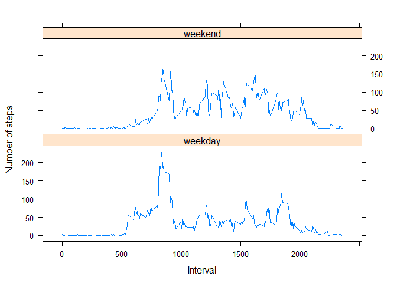

# Reproducible Research: Peer Assessment 1


## Loading and preprocessing the data

Load the data from file into a dataframe "activity"


```r
activity <- read.csv("activity.csv", stringsAsFactors=FALSE)
```

aggregate the number of steps per day and show the frequency in a histogram

```r
steps.per.day <- aggregate(steps ~ date, data = activity, FUN = sum)

hist(steps.per.day$steps, breaks=25, main="Total number of steps per day", xlab="Steps per day", col="red")
```

 

## What is mean and median total number of steps taken per day?


```r
mean.1 <-mean(steps.per.day$steps)
mean.1
```

```
## [1] 10766.19
```

```r
median.1 <- median(steps.per.day$steps)
median.1
```

```
## [1] 10765
```

## What is the average daily activity pattern?
A time series plot of the 5-minute interval (x-axis) and the average number of steps taken, averaged across all days (y-axis)


```r
steps.by.interval.mean <- aggregate(steps ~ interval, data = activity, FUN = mean)
plot(steps.by.interval.mean, type = "l")
```

 

The 5-minute interval, on average across all the days in the dataset, which contains the maximum number of steps


```r
max.interval = which.max(steps.by.interval.mean$steps)
max.interval
```

```
## [1] 104
```

## Imputing missing values

Calculate and report the total number of missing values in the dataset (i.e. the total number of rows with NAs)

```r
missing.steps <- which(is.na(activity$steps))
length(missing.steps)
```

```
## [1] 2304
```
Devise a strategy for filling in all of the missing values in the dataset. The strategy does not need to be sophisticated. For example, you could use the mean/median for that day, or the mean for that 5-minute interval, etc.

We use the ceiling value of the calculated average 5-minute interval values to replace the NA values of the original data.

Create a new dataset that is equal to the original dataset but with the missing data filled in.


```r
steps.by.interval.mean$steps <- ceiling(steps.by.interval.mean$steps)

activity.filled <- activity
activity.filled[missing.steps, "steps"] <- steps.by.interval.mean[steps.by.interval.mean == activity.filled[missing.steps, "interval"], "steps"]
```


Make a histogram of the total number of steps taken each day and Calculate and report the mean and median total number of steps taken per day. Do these values differ from the estimates from the first part of the assignment? What is the impact of imputing missing data on the estimates of the total daily number of steps?


```r
steps.per.day.2 <- aggregate(steps ~ date, data = activity.filled, FUN = sum)
hist(steps.per.day.2$steps, breaks=25, main="Total number of steps per day", xlab="Steps per day", col="blue")
```

 

```r
mean.2 <- mean(steps.per.day.2$steps)
mean.2
```

```
## [1] 10784.92
```

```r
median.2 <-median(steps.per.day.2$steps)
median.2
```

```
## [1] 10909
```

mean: increase in percentage

```r
100 *(mean.2 - mean.1)/mean.1
```

```
## [1] 0.1739646
```
median:  increase in percentage

```r
100 *(median.2 - median.1)/median.1
```

```
## [1] 1.337668
```

## Are there differences in activity patterns between weekdays and weekends?

Create a new factor variable in the dataset with two levels – “weekday” and “weekend” indicating whether a given date is a weekday or weekend day.


```r
# Set to English names for the weekdays
Sys.setlocale("LC_TIME", "English")
```

```
## [1] "English_United States.1252"
```

```r
days <- weekdays(as.Date(activity.filled$date)) %in% c('Saturday','Sunday')
activity.filled$dayType <- factor(days, labels = c("weekday", "weekend"))
```

Make a panel plot containing a time series plot (i.e. type = "l") of the 5-minute interval (x-axis) and the average number of steps taken, averaged across all weekday days or weekend days (y-axis). See the README file in the GitHub repository to see an example of what this plot should look like using simulated data.


```r
activity.filled.daytype.mean <- aggregate(
    data=activity.filled,
    steps ~ dayType + interval,
    FUN=mean
)

library("lattice")

xyplot(
    type="l",
    data=activity.filled.daytype.mean,
    steps ~ interval | dayType,
    xlab="Interval",
    ylab="Number of steps",
    layout=c(1,2)
)
```

 

On week days people tend to walk more in the early  hours

